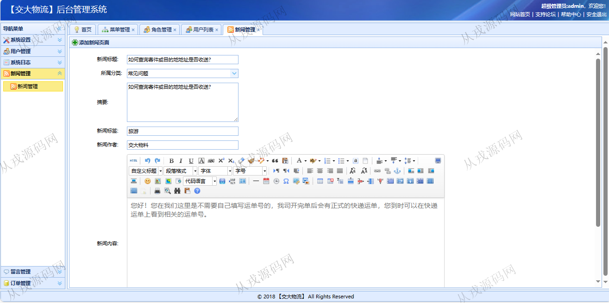

<h1 align="center">216.物流快递管理系统</h1>

- <b>完整代码获取地址：从戎源码网 ([https://armycodes.com/](https://armycodes.com/))</b>
- <b>技术探讨、资料分享，请加QQ群：692619798</b> 
- <b>作者微信：19941326836  QQ：952045282</b> 
- <b>承接计算机毕业设计、Java毕业设计、Python毕业设计、深度学习、机器学习</b>
- <b>选题+开题报告+任务书+程序定制+安装调试+论文+答辩ppt 一条龙服务</b>
- <b>所有选题地址 ([https://github.com/YuLin-Coder/AllProjectCatalog](https://github.com/YuLin-Coder/AllProjectCatalog)) </b>

## 项目介绍
基于ssm的物流快递管理系统：前端 jsp、jquery、easyui，后端 springmvc、spring、mybatis；角色分为管理员、用户；集成在线下单、新闻资讯、订单管理等功能于一体的系统。

## 功能介绍

### 网站前台

- 网站首页：主导航栏，轮播图，新闻资讯，服务介绍
- 在线下单：填写发货人和收货人信息，提交订单，按快递单号查询快递明细
- 新闻资讯：资讯信息列表展示，资讯详情

### 管理后台

- 菜单管理：菜单信息的增删改查
- 角色管理：角色信息的增删改查，编辑权限
- 用户列表：用户信息的增删改查，角色分配
- 新闻管理：新闻信息的增删改查，新闻内容支持富文本编辑
- 留言列表：列表信息的列表查询，信息删除，信息编辑，按姓名和联系方式模糊查询
- 订单管理：订单信息的增删改查，多条件查询，更新订单状态

## 环境

- <b>IntelliJ IDEA 2021.3</b>

- <b>Mysql 5.7.26</b>

- <b>Tomcat 7.0.73</b>

- <b>JDK 1.8</b>

## 运行截图

